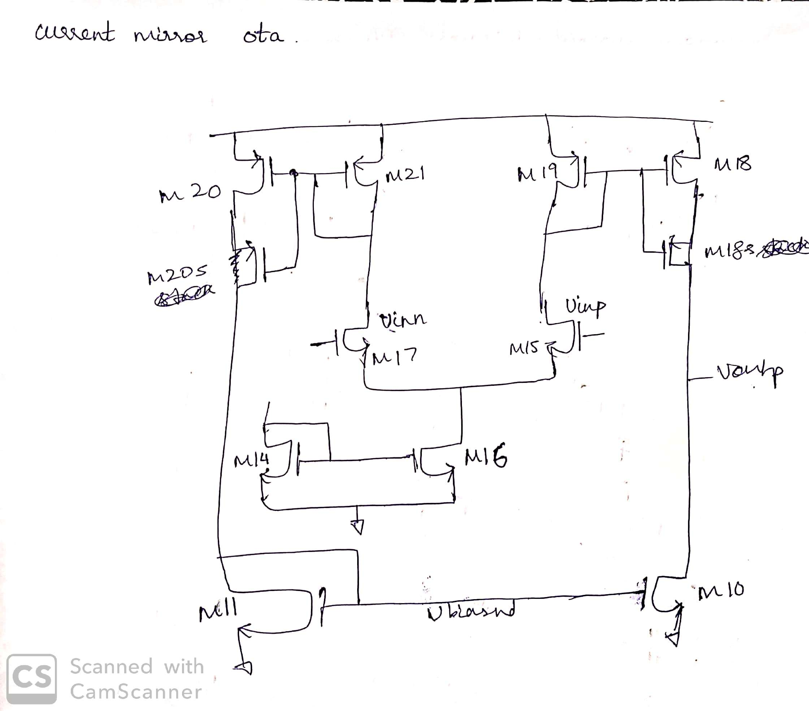
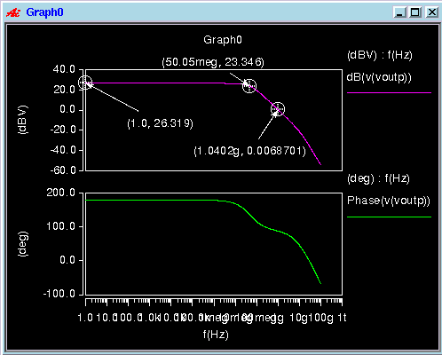

## Current Mirror OTA - single ended

### Circuit Description

This OTA (Operational Transconductance Amplifier) circuit is used to achieve good gain and comparably higher output swing.

The diagram of the circuit is as follows.

### Pin description

* Vin - input common mode DC + input AC
* Voutp - output of the amplifier
* id - bias current input to tail current mirror
* Vdd - supply voltage

### Initial setup + Testbench

The initial setup, for the voltages and currents to these input pins, and the testbench is present in the spice file.

Simulations
* DC - operating point information
* AC - gain, three dB frequency, unity gain frequency, phase margin

The AC response plot is shown below

### Performance Metrics

* Gain - 26 dB
* Three dB frequency - 50 MHz
* Unity gain frequency - 1.04 GHz
* Phase margin ~ 80 degrees

### Constraints

* The input differential pair in the schematic needs to be matched
* The current mirrors shown in the schematic need to be matched
