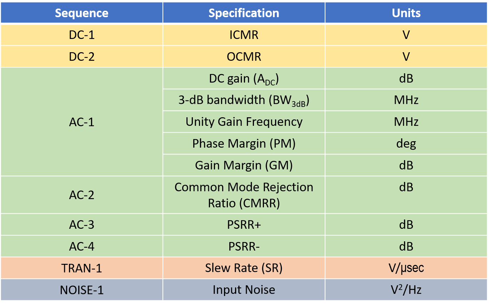
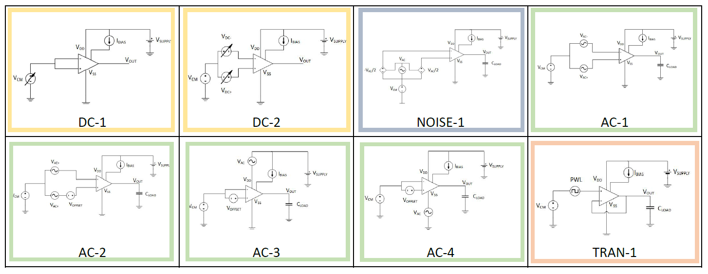

## Single-ended OTA testbench

The table below contains all the important OTA performance metrics and the corresponding simulation used to evaluate.

  

The figure below contains a brief summary of the setup used for each of the testbenches listed above.

  

