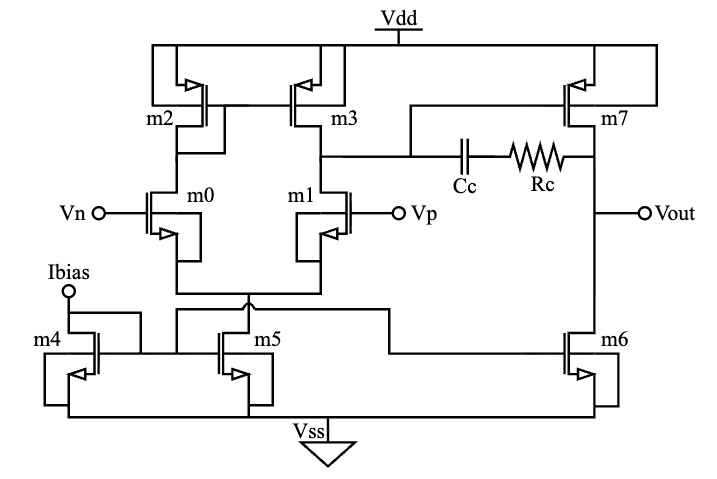
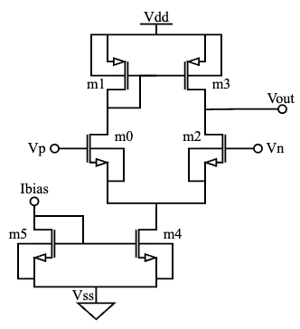
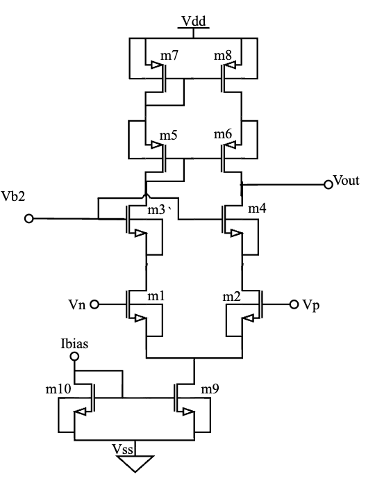
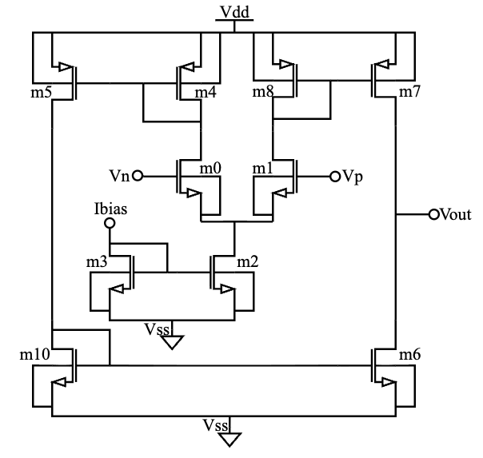
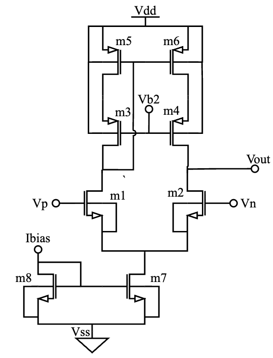

# Single-Ended OTA Testbench Suite

This directory contains reusable HSPICE testbenches for single-ended operational transconductance amplifiers (OTAs). Each DUT netlist is adapted through `dut_wrapper.sp` so the same testbench set can be reused across OTA topologies with a common external pin order.

## Directory Contents

| Path | Purpose |
| --- | --- |
| `dut/` | OTA DUT netlists and reference schematic images. |
| `testbenches/` | AC, CMRR, ICMR, OCMR, PSRR, slew-rate, and operating-point decks. |
| `design_params.sp` | Shared supplies, bias, load, simulator options, and placeholder device sizing parameters. |
| `dut_wrapper.sp` | Adapter that instantiates the selected `DUT` netlist as `DUT_UNIVERSAL`. |

The old top-level `tb_ac.sp` deck has been removed. Use `testbenches/tb_ac.sp`.

## DUT Library

The default DUT selected by `dut_wrapper.sp` is `dut/5t_ota.sp`.

| DUT | Netlist | `DUT_HAS_VB2` | Image |
| --- | --- | ---: | --- |
| Two-stage OTA | `dut/2s_ota.sp` | `0` |  |
| Five-transistor OTA | `dut/5t_ota.sp` | `0` |  |
| Cascode OTA | `dut/cascode_ota.sp` | `1` |  |
| Current-mirror OTA | `dut/cm_ota.sp` | `0` |  |
| Low-voltage cascode OTA | `dut/lv_cas_ota.sp` | `1` |  |

Raw DUT netlists use one of these pin lists:

```spice
* DUT_HAS_VB2 = 0
.subckt DUT vp vn vout vdd vss ibias

* DUT_HAS_VB2 = 1
.subckt DUT vp vn vout vdd vss ibias vb2
```

The wrapper always exports:

```spice
.subckt DUT_UNIVERSAL vp vn vout vdd vss ibias vb2
```

For DUTs without `vb2`, `dut_wrapper.sp` ignores the wrapper `vb2` pin.

## Selecting a DUT

Edit `dut_wrapper.sp` and change the include line:

```spice
.include "dut/5t_ota.sp"
```

Then set `DUT_HAS_VB2` in each testbench:

```spice
.param DUT_HAS_VB2 = 0   $ 2s_ota, 5t_ota, cm_ota
.param DUT_HAS_VB2 = 1   $ cascode_ota, lv_cas_ota
```

For cascode-style DUTs, also set:

```spice
.param VB2_DC = 600m
```

`design_params.sp` includes placeholder sizing parameters for `m0` through `m10`, plus `c0` and `r0`. Replace these placeholders with the intended values for the selected DUT before using measured results.

The DUT devices reference technology model names such as `nch_lvt` and `pch_lvt`. Add the required PDK model include or library statement through your simulator setup, in the testbench, or in `design_params.sp`.

## Running

Run the decks with include paths resolved relative to the input file, or run from a location where the `../design_params.sp` and `../dut_wrapper.sp` includes are valid for files under `testbenches/`.

```bash
hspice -i testbenches/tb_ac.sp    -o runs/ac
hspice -i testbenches/tb_cmrr.sp  -o runs/cmrr
hspice -i testbenches/tb_icmr.sp  -o runs/icmr
hspice -i testbenches/tb_ocmr.sp  -o runs/ocmr
hspice -i testbenches/tb_psrrp.sp -o runs/psrrp
hspice -i testbenches/tb_psrrn.sp -o runs/psrrn
hspice -i testbenches/tb_sr.sp    -o runs/slew_rate
hspice -i testbenches/tb_op.sp    -o runs/op
```

Typical HSPICE outputs include `.lis` logs, `.mt*` measurement files, and waveform databases because the decks set `.option post=2`.

## Recommended Flow

1. Select the DUT in `dut_wrapper.sp`.
2. Set `DUT_HAS_VB2` and `VB2_DC` in each testbench as needed.
3. Replace placeholder sizes in `design_params.sp`.
4. Add or enable the correct PDK model library.
5. Run `testbenches/tb_ac.sp` first to obtain low-frequency gain, UGF, phase margin, bandwidth, and gain margin.
6. Copy AC results into dependent decks:
   - Set `A0_DIFF_DB` in `testbenches/tb_cmrr.sp`.
   - Set `ADC_GAIN_DB` in `testbenches/tb_psrrp.sp` and `testbenches/tb_psrrn.sp`.
   - Set `UGF_EST`, `VICMR_MIN`, and `VICMR_MAX` in `testbenches/tb_sr.sp`.
7. Run the DC range tests and transient slew-rate test.
8. Run `testbenches/tb_op.sp` when you need operating-point listing details.

## Testbench Summary

| Testbench | Analysis | Main measurements | Purpose |
| --- | --- | --- | --- |
| `testbenches/tb_ac.sp` | `.op`, `.ac` | `A0_DB`, `UGF`, `PM`, `BW_3DB`, `GM_DB` | Open-loop gain and stability. |
| `testbenches/tb_cmrr.sp` | `.op`, `.ac` | `ACM_DB`, `CMRR_DB` | Common-mode rejection. |
| `testbenches/tb_icmr.sp` | `.dc` | `ICMR_MIN`, `ICMR_MAX`, `ICMR_RANGE` | Valid input common-mode range. |
| `testbenches/tb_ocmr.sp` | `.dc` | `OCMR_MIN`, `OCMR_MAX`, `OCMR_RANGE` | Valid output common-mode swing in unity feedback. |
| `testbenches/tb_psrrp.sp` | `.op`, `.ac` | `APS_PLUS_DB`, `PSRR_PLUS_DB` | Positive-supply ripple rejection. |
| `testbenches/tb_psrrn.sp` | `.op`, `.ac` | `APS_MINUS_DB`, `PSRR_MINUS_DB` | Negative-supply ripple rejection. |
| `testbenches/tb_sr.sp` | `.tran` | `SR_POS_Vus`, `SR_NEG_Vus` | Positive and negative slew rate. |
| `testbenches/tb_op.sp` | `.dc` dummy sweep | Operating-point listing | Device operating-point extraction. |

## Measurement Notes

### AC Gain and Stability

`tb_ac.sp` applies a 1 V total differential AC input:

```spice
VINP vp 0 DC VCM AC 0.5 0
VINN vn 0 DC VCM AC 0.5 180
EDIFF vdiff 0 vp vn 1
```

Because `vm(vdiff)` is 1 V, `vm(vout)/vm(vdiff)` gives differential gain directly. The deck measures low-frequency gain, unity-gain frequency, phase margin, 3 dB bandwidth, and gain margin.

### CMRR

`tb_cmrr.sp` drives both inputs with the same AC signal while keeping a small DC offset:

```spice
E_VIP vip 0 VOL='v(n_cm_ref) + v(n_ac_cm) + V_OFFSET/2'
E_VIN vin 0 VOL='v(n_cm_ref) + v(n_ac_cm) - V_OFFSET/2'
```

It computes:

```spice
CMRR_DB = A0_DIFF_DB - ACM_DB
```

Update `A0_DIFF_DB` from the AC gain deck before trusting this value.

### ICMR

`tb_icmr.sp` connects the DUT as a unity-gain follower and sweeps the input common-mode voltage from `VCM_START` to `VCM_STOP`. It monitors output tracking error and total supply current:

```spice
error_node = abs(v(vout) - v(vcm))
idd_node   = abs(i(VVDD))
```

`ICMR_MIN` is based on recovery to 95% of nominal supply current. `ICMR_MAX` is based on tracking error exceeding the nominal error by 10 mV.

### OCMR

`tb_ocmr.sp` sweeps the unity-gain buffer input rail-to-rail and uses the output slope to estimate valid output swing. The valid range is where the slope remains above 80% of the peak slope.

### PSRR

`tb_psrrp.sp` injects a 1 V AC perturbation on `vdd`. `tb_psrrn.sp` injects a 1 V AC perturbation on `vss`. Both compute PSRR as:

```spice
PSRR = ADC_GAIN_DB - supply_gain_db
```

Update `ADC_GAIN_DB` from the AC gain deck first.

### Slew Rate

`tb_sr.sp` configures the OTA as a unity-gain buffer and steps the input between `VICMR_MIN` and `VICMR_MAX`. It reports positive and negative slew rate in V/us using 10% to 90% output transition times.

### Operating Point

`tb_op.sp` biases the OTA at a fixed common-mode input voltage and runs a dummy DC sweep to force printed operating-point output in the HSPICE listing.

## Practical Notes

- The wrapper does not auto-detect DUT pins. Keep `DUT_HAS_VB2` consistent with the selected DUT.
- The decks are written for HSPICE syntax and measurement functions such as `.meas`, `deriv()`, `vm()`, `vp()`, and `vdb()`.
- Several decks contain placeholder measured values. Update them after running the earlier decks in the recommended flow.
- If include-path errors occur, adjust the run directory or include paths consistently for all decks.
