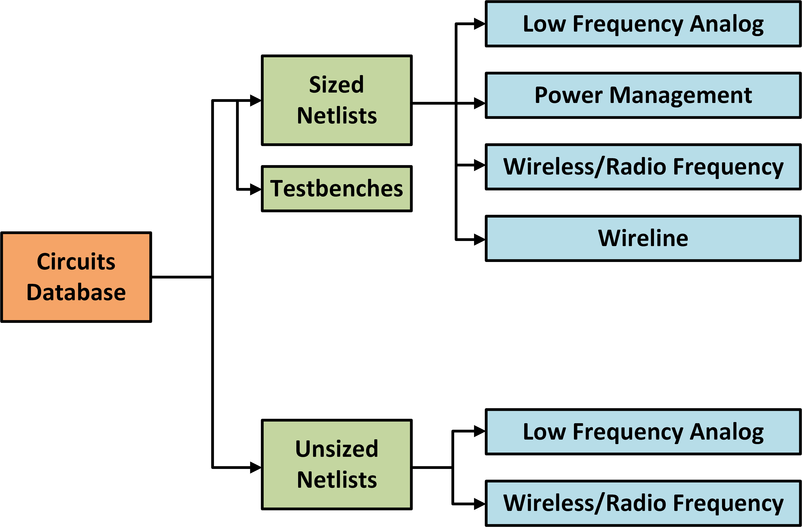

# Circuits Database

  

* Sized netlists - Contains sized netlists in different technology nodes
* Unsized netlists - Contains unsized netlists generated for training GCN based netlist annotation
* Generalized testbenches - Contains exhaustive testbenches suited for circuits with different internal topologies with similar functions and pin structure

## Sized netlists

Designs from four classes of circuits:

* Low frequency analog
* Power Management
* Wireless/Radio frequency
* Wireline

## Unsized netlists

Currently contains designs from two classes of circuits:

* Low frequency analog

## Generalized Testbenches

Generalized testbenches enabling plug and play of common modules with different internal topologies to exhaustively characterize their performance
