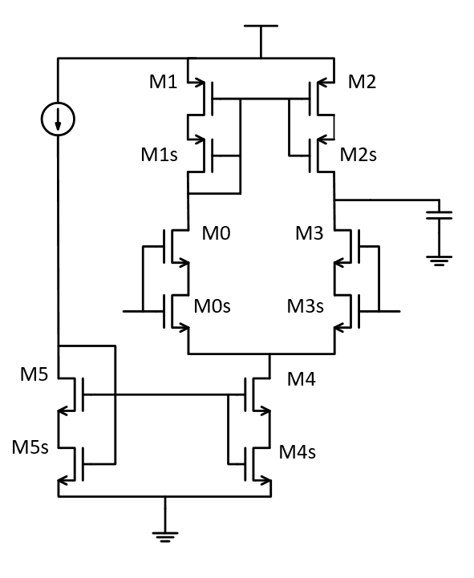

## Five Transistor OTA - single ended stacked

### Circuit Description

This OTA (Operational Transconductance Amplifier) circuit is used to achieve good gain.

The diagram of the circuit is as follows.

### Pin description

* Vinn - input common mode DC + input AC
* Vinp - input common mode DC + input AC
* Voutp - output of the amplifier
* id - bias current input to tail current mirror
* Vdd - supply voltage

### Initial setup + Testbench

The initial setup, for the voltages and currents to these input pins, and the testbench is present in the spice file.

Simulations
* DC - operating point information
* AC - gain, three dB frequency, unity gain frequency, phase margin

### Performance Metrics

* Current - 50 uA
* Gain - 32 dB
* Three dB frequency - 14 MHz
* Unity gain frequency - 598 MHz
* Phase margin ~ 87 degrees

### Constraints

* The input differential pair in the schematic needs to be matched
* The current mirrors shown in the schematic need to be matched
