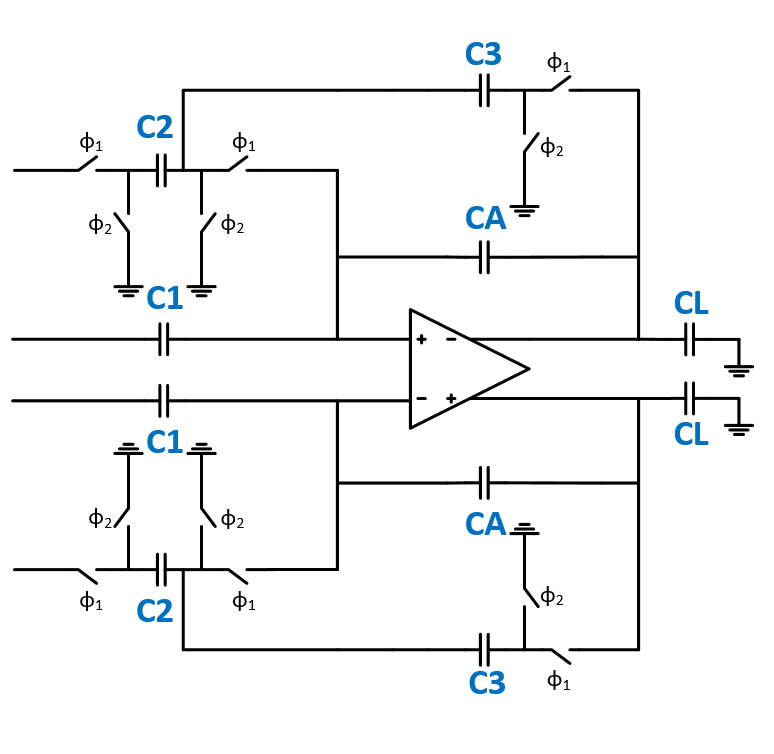
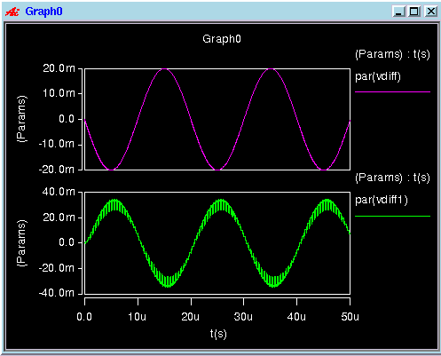

## Fully differential Switched Capacitor Filter

### Circuit Description

This is a low pass filter circuit. It contains a fully differential telescopic OTA, switched capacitor common mode feedback circuit and a non-overlapping clock generator.

The diagram of the circuit is as follows.

### Pin description

* Vinp - input common mode DC + input AC
* Vinn - input common mode DC + input AC
* Voutp - output of the amplifier
* Voutn - output of the amplifier
* Vdd - supply voltage
* Bias voltages and currents

### Initial setup + Testbench

The initial setup, for the voltages and currents to these input pins, and the testbench is present in the spice file.

Simulations
* DC - operating point information
* Transient - this can be used to visualize the gain of the amplifier

The transient response plot is shown below

### Performance Metrics

* Gain - 6 dB

### Constraints

* The differential paths in the filter must be symmetric and matched
* The differential pair and current mirror in the OTA circuit need to be matched
