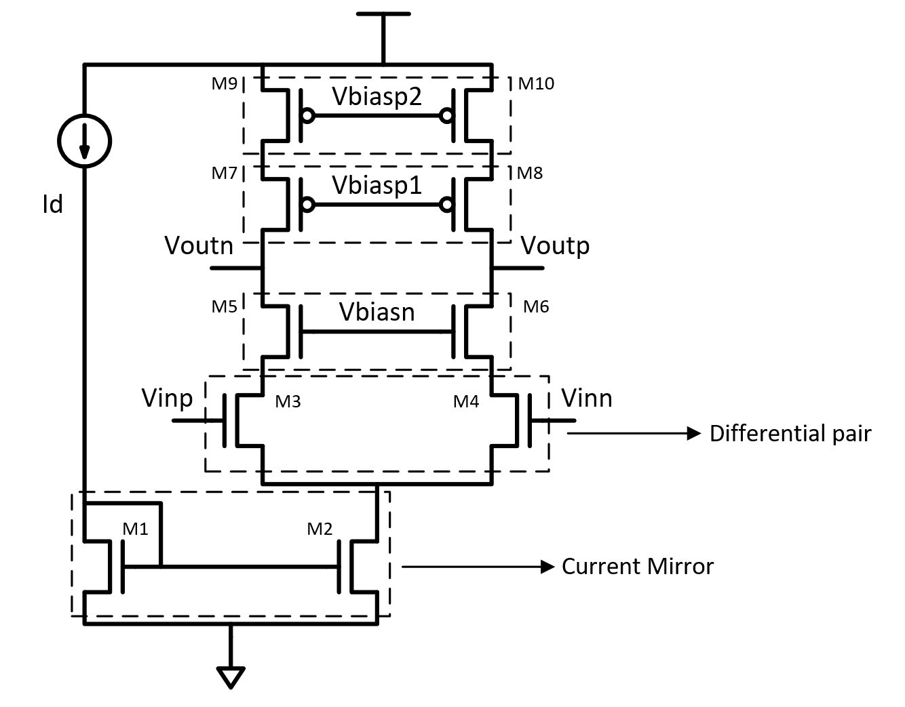

## Fully differential Telescopic OTA

### Circuit Description

This OTA (Operational Transconductance Amplifier) circuit is used to achieve high gain and comparably higher output swing.

The diagram of the circuit is as follows.

Switched capacitor common mode feedback is implemented, with a non-overlapping clock generator.

### Pin description

* Vin - input common mode DC + input AC
* Voutp - output of the amplifier
* Id - bias current input
* Vdd - supply voltage
* bias voltages

### Initial setup + Testbench

The initial setup, for the voltages and currents to these input pins, and the testbench is present in the spice file.

Simulations
* DC - operating point information
* Transient - this can be used to visualize the gain of the amplifier

The transient response plot is shown below

### Performance Metrics

* Gain - 45 dB

### Constraints

* The input differential pair in the schematic needs to be matched
* The current mirrors shown in the schematic need to be matched
