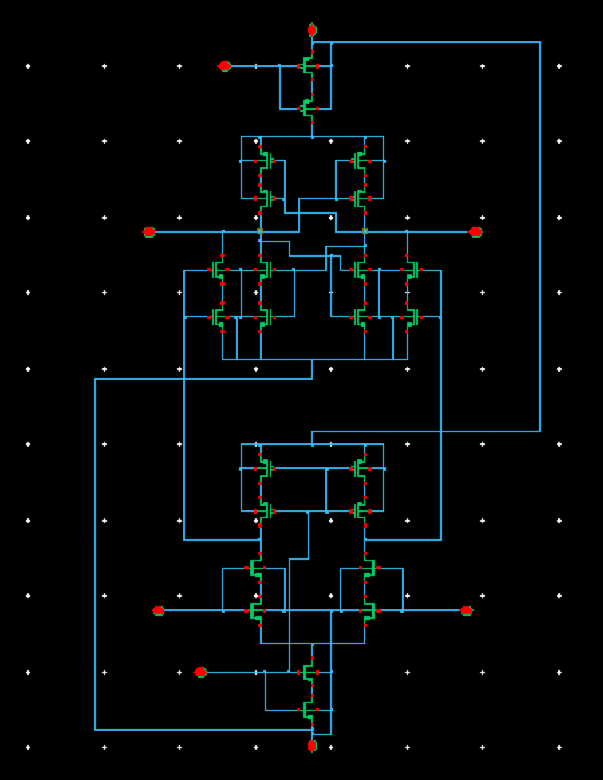

## Double tail sense amplfier

### Circuit Description

The double tail sense amplfier is used to read low-voltage inputs.

### Pin description

* in1, in2 - inputs common mode DC + input AC
* out1, out2  - outputs 
* vps - supply voltage
* vgnd - ground
* clk - clock signal
* clkb - inverse clock signal
