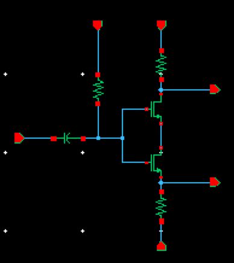

## Single to differential converter

### Circuit Description

The single to differential converter circuit is used to create two differential signals from a signal.

### Pin description

* vin - input common mode DC + input AC
* vout_sdc1,vout_sdc2 - outputs of the SDC
* vb - bias for the nmos transistor
* vps - supply voltage
* vgnd - ground

### Initial setup + Testbench

The initial setup, for the voltages and currents to these input pins, and the testbench is present in the spice file.

Simulations
* DC - operating point information
* AC - gain, three dB frequency, unity gain frequency, phase margin
* Tran - to check whether output voltage is distorted
