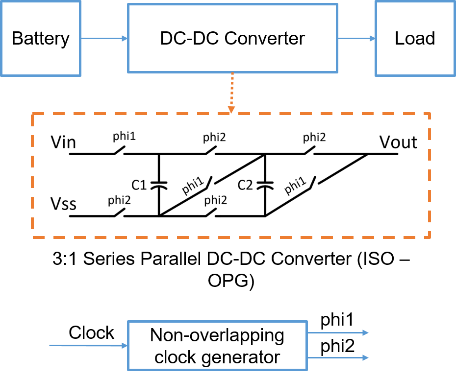

## 3:1 series parallel SC DC DC Converter

### Circuit Description

The SC DC DC converter is a 3:1 converter that in this testbench converts a voltage of 2 V to about 0.6 V

### Pin description

* Vin - input common mode DC + input AC
* Vout - output node connected to a load resistor and capacitor
* phi1 - clock signal
* phi2 - clock signal

Phi1 and phi2 are non-overlapping clock signals

### Initial setup + Testbench

The initial setup, for the voltages and currents to these input pins, and the testbench are present in the spice file.

This design has 200 pF flying capacitors and operates at a frequency of 200 MHz

Simulations
* Transient - efficiency of the converter 

### Performance Metrics

* Conduction loss + Parasitic loss - 394 uW
* Switching loss - 17 uW
* Output voltage - 0.59 V
* Output current - 4.69 mA
* Efficiency - 87 %

### Constraints

* Routing parasitics are very critical in this circuit and need to be minimized
