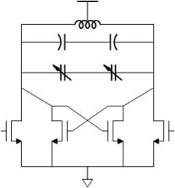

## Bandpass filter circuit
A bandpass filter circuit is used for filtering band of signal frequencies at a center frequency (fc).

### Circuit description
The circuit requires inductors and capacitors for tuning the center frequency. As inductors are huge in size as compared to capacitors,
capacitors are used for tuning the center frequencies. To remove the parallel resistance in the LC circuit, a cross-coupled transistors 
are used which add negative resistance.  

  

### Testbench/Simulations
An AC and transient simulation is required to measure the perfomance of bandpass filter. An AC simulation will measure the quality factor 
(Q) of the filter. 

### Performance metrics
* Quality Factor (Q)
* Center frequency (fc)
* Bandwidth

### Constraints
The parasitics around output node must be minimized to reduce variations of center frequency.
