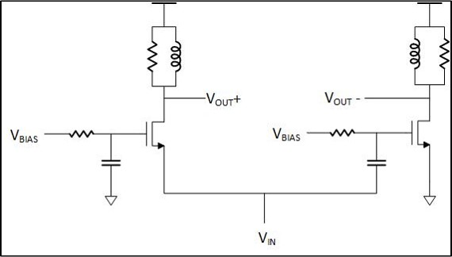

## LNA

### Circuit description
LNA are used at RF front end of receiver to set Noise floor of the system.

  

### Testbench/Simulations
AC simulation is used to check the gain. A noise simulation is required to check noise figure (NF) of LNA.
Transient simulation is used for checking IIP3 of LNA.

A spectre testbench for S11 and Noise figure is added in LNA\_TB.scs 

### Performance metrics
* Gain
* Noise figure
* IIP3

### Constraints
A guard ring must be covering all transistors in LNA. Wide metal lines to reduce resistance over lines.
