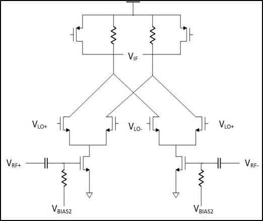

## Mixer

### Circuit description
Mixers are used for translating RF signals to IF signals or IF signals to RF signals using local oscillator frequency.

  

 
### Testbench/Simulations
Transient simulation is used for checking the output spectrum. PSP simulation is used to calculate the conversion gain. 

A spectre testbench is defined in MIXER\_TB.scs
### Performance metrics
* IIP3
* Conversion Gain

### Constraints
Symmetric routing is critical for correct IF/RF output generation. Shielding the nets is recommended.
