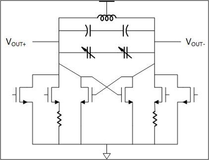

## Oscillator

### Circuit description
For a oscillator circuit, a LC tank circuit is required. To cancel the parallel resistance in LC circuit, a cross coupled transistor pair
cancels the positive resistance by adding a negative resistance.

  

### Testbench/Simulations
Transient simulation is required to check lock range.

### Performance metrics
* Lock Range

### Constraints
Symmetric routes are required for differential output nets. Minimum parasitic for each net is critical for performance.
