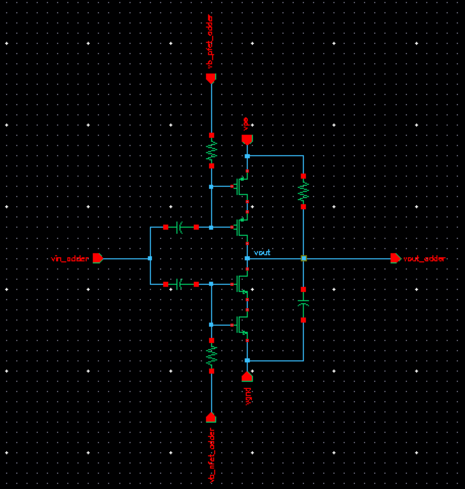

## Adder

### Circuit Description

The adder unit is used to add two or more signals.

### Pin description

* vin - input common mode DC + input AC
* vout - output of the adder
* vb1 - bias for the nmos transistor
* vb2 - bias for the pmos transistor
* vps - supply voltage
* vgnd - ground

### Initial setup + Testbench

The initial setup, for the voltages and currents to these input pins, and the testbench is present in the spice file.

Simulations
* DC - operating point information
* AC - gain, three dB frequency, unity gain frequency, phase margin
* Tran - to check whether output voltage is distorted
