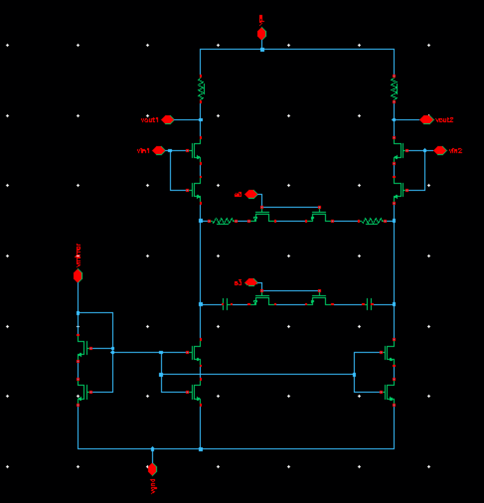

## Linear equalizer 2 switches

### Circuit Description

The linear equalizer is used to attenuate low-frequency content and amplify high frequency contents. This LE has 2 switches to vary low and high frequency gain.

### Pin description

* vin1, vin2 - inputs common mode DC + input AC
* vout1, vout2 - outputs
* vmirror - bias for the current mirror block
* s0, s1 - Switches to vary low and high frequency gain
* vps - supply voltage
* vgnd - ground
