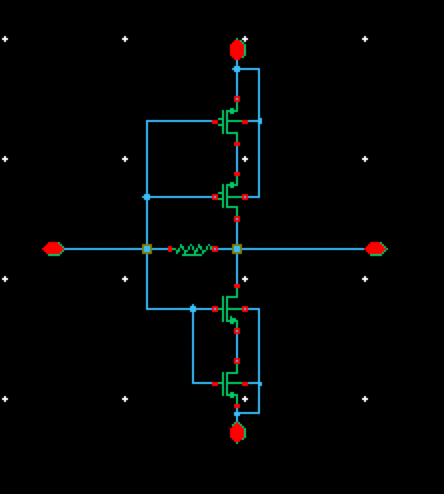

## Transimpedance amplifier

### Circuit Description

The transimpedance amplifier circuit converts current to voltage.

### Pin description

* vin - input common mode DC + input AC
* vout  - output 
* vps - supply voltage
* vgnd - ground
