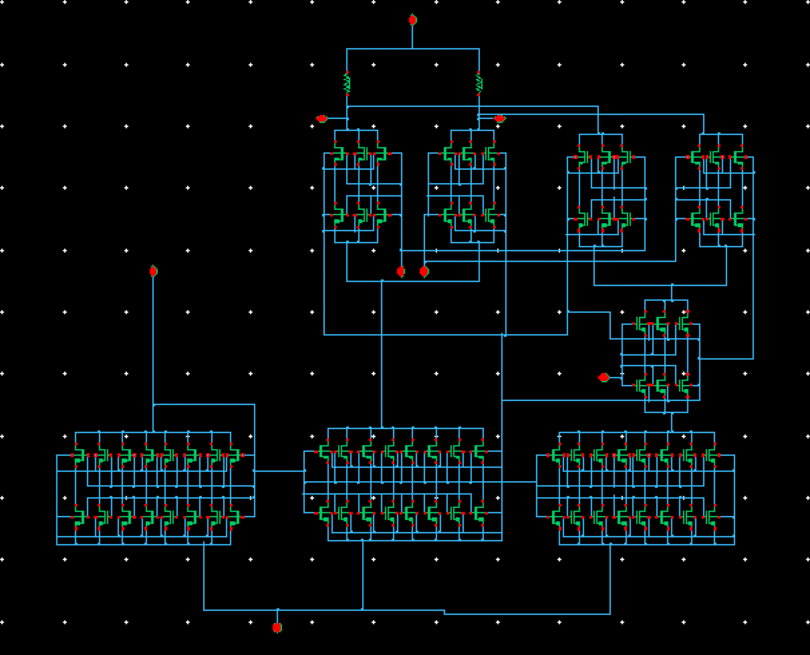

## Variable gain amplifier

### Circuit Description

The variable gain amplifier is used to amplify or, attenuate an input signal with varing gain.

### Pin description

* vin1, vin2 - inputs common mode DC + input AC
* vout1, vout2 - outputs of the VGA
* vmirror - bias for the nmos current mirror
* s0 - Switch to vary gain. Can be set it to either '1' or '0'.
* vps - supply voltage
* vgnd - ground

### Initial setup + Testbench

The initial setup, for the voltages and currents to these input pins, and the testbench is present in the spice file.

Simulations
* DC - operating point information
* AC - gain, three dB frequency, unity gain frequency, phase margin
* Tran - to check whether output voltage is distorted
