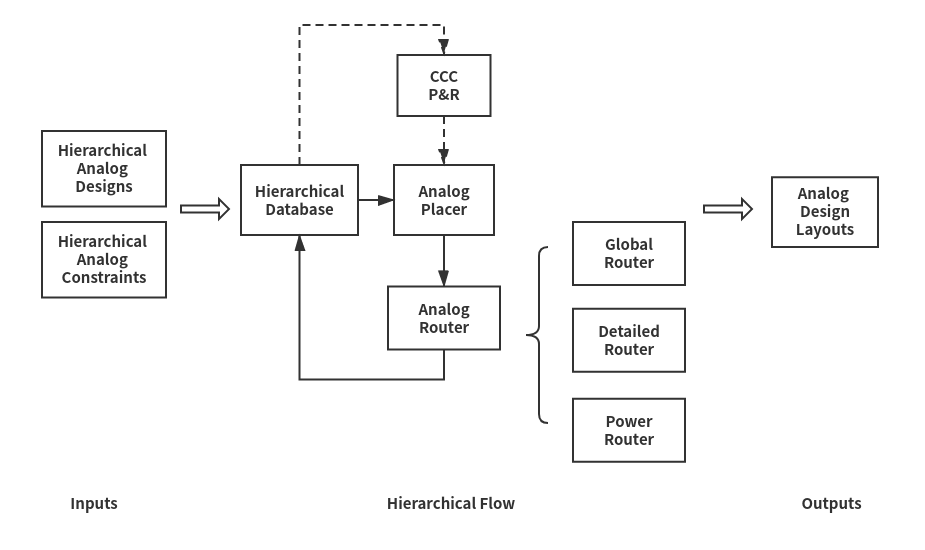

# ALIGN: Hierarchical Analog Placer and Router Flow

## Brief description
The Hierarchical Placer and Router Flow automatically generates layouts for constraints-based analog designs. There are four components in the flow: 
* _Hierarchical Database (HD)_, which stores the data of hierarchical analog designs and constraints.
* _Common Centroid Capacitor (CCC) Placer and Router (P&R)_, which generates common centroid layout for capacitor array when necessary.
* _Analog Placer_, which places the hierarchical blocks and handles geometrical constraints, such as symmetry, and alignment constraints.
* _Analog Router_, which handles routing constraints, such as symmetry, shielding and parallel routing constraints, and is composed of global router, detailed router and power router.




The top down route flow (recursive) is as below:  
```key
top_down_route(topnode)  
    1.copy current_node from hiertree  
    2.transform all points and rects of current_node into topnode coordinate (absolute coordinate)  
    for childnode in current_node.blocks  
        3.calculate childnode's orientation and bounding box (in topnode coordinate)  
        4.top_down_route(childnode)  
        5.update childnode into current_node.block(in topnode coordinate)  
        6.link current_node to the childnode  
    7.route current_node (in topnode coordinate) and write gds.json (in current_node coordinate)  
    8.transform all points and rects of current_node into current_node coordinate  
    9.add current_node to hiertree
```


## Software description

Inputs:
* Analog designs

  - Verilog netlist
  - LEF
  - XX.gds.json for subblock in Verilog netlist
  - GDSII map file
  - PDK file

* Constraints file

* Example: [testcase_example](https://github.com/ALIGN-analoglayout/ALIGN-public/tree/master/PlaceRouteHierFlow/testcase_example)

Outputs: 
* Analog design layouts

  - XX.gds.json

## Installation/getting started

### Prerequisite

* g++ 7.2 or above
* ILP solver: version 5.5.2.5 <http://lpsolve.sourceforge.net/5.5/>
* C++ json library: <https://github.com/nlohmann/json.git>
* C++ boost libraries: <https://github.com/boostorg/boost>
* GTEST: <https://github.com/google/googletest>

### Run in Docker
Please follow the instructions in [run in docker](https://github.com/ALIGN-analoglayout/ALIGN-public/blob/master/build/README.md)

### Run in local
1. Set environment
```Shell
export LP_DIR=<LP_DIR>/lpsolve
export LD_LIBRARY_PATH=<LP_DIR>/lpsolve/lp_solve_5.5.2.5_dev_ux64
export JSON=<JSON_DIR>/json
export BOOST_LP=<BOOST_DIR>/boost
export GTEST_DIR =<GTEST_DIR>/gtest/googletest/googletest
```
2. Compile the flow
```Shell
make
```
3. Run test case
```Shell
./pnr_compiler testcase_DIR testcase.lef testcase.v testcase.map testcase.json testcaseTop numOfLayout optEffort
```

Inputs explanation:
* testcase_DIR: string type; the directory of input data
* testcase.lef: string type; LEF file
* testcase.v: string type; Verilog file
* testcase.map: string type; map file for gds.json
* testcase.json: string type; PDK file in.json format
* testcaseTop: string type; top module name in netlist
* numOfLayout: integer type; the max number of generated layouts
* optEffort: integer type; optimization effort in range of 0 to 2 (0: low, 1: median, 2: high)

Outputs explanation: (all the results will be saved under 'Results' folder by default)
* xx.plt: GNUplot file of placement results
* Capxx.gds.json: JSON format of CCC P&R layout
* xx_PL.gds.json: JSON format of placement layout
* xx_GL.gds.json: JSON format of global routing layout
* xx_DR.gds.json: JSON format of detailed routing layout
* xx_PR.gds.json: JSON format of power routing layout

## Usage

If the flow is run locally, the operations listed below are necessary:

1) To get the XX_gds.json file, Verlog file, Map file and LEF file, please use the code [Cell Generation](https://github.com/ALIGN-analoglayout/ALIGN-public/tree/master/align/cell_fabric)

2) To get the PDK file, please use the code [PDK abstraction](https://github.com/ALIGN-analoglayout/ALIGN-public/tree/master/pdks)

3) Currently the input/output layout files are in JSON format. To convert the format (from json to GDSII or from GDSII to json), please use the codes [GDSConv](https://github.com/ALIGN-analoglayout/ALIGN-public/tree/master/align/gdsconv).

## Limitations

1) The flow is mainly developed and tested by [ASAP7 PDK](http://asap.asu.edu/asap/). The code is being updated to support the FinFET MockPDK. The flow has been applied by the ALIGN team to synthesize designs in a commercial FinFET process and a commercial bulk process. In the future, the flow should be able to to run more test cases by other PDKs. 

## To-do

1) Top-down placement optimization.
2) Guard ring insertion.
3) Data structure optimization.
4) Detailed router code optimization.
5) Exercising more complex test cases for routing constraints.

## LICENSE

Third-paty license:

* The license for ILP solver can be found [lp_solve license](http://lpsolve.sourceforge.net/5.5/)
* The license for json library can be found [json library license](https://github.com/nlohmann/json/blob/develop/LICENSE.MIT)
* The license for boost library can be found [boost library license](https://github.com/boostorg/boost/blob/master/LICENSE_1_0.txt)
* The license for gtest can be found [gtest license](https://github.com/google/googletest/blob/master/LICENSE)

The rest of this repository is licensed under BSD 3-Clause License.

>BSD 3-Clause License
>
>Copyright (c) 2019, The Regents of the University of Minnesota
>
>All rights reserved.
>
>Redistribution and use in source and binary forms, with or without
>modification, are permitted provided that the following conditions are met:
>
>* Redistributions of source code must retain the above copyright notice, this
>  list of conditions and the following disclaimer.
>
>* Redistributions in binary form must reproduce the above copyright notice,
>  this list of conditions and the following disclaimer in the documentation
>  and/or other materials provided with the distribution.
>
>* Neither the name of the copyright holder nor the names of its
>  contributors may be used to endorse or promote products derived from
>  this software without specific prior written permission.
>
>THIS SOFTWARE IS PROVIDED BY THE COPYRIGHT HOLDERS AND CONTRIBUTORS "AS IS"
>AND ANY EXPRESS OR IMPLIED WARRANTIES, INCLUDING, BUT NOT LIMITED TO, THE
>IMPLIED WARRANTIES OF MERCHANTABILITY AND FITNESS FOR A PARTICULAR PURPOSE ARE
>DISCLAIMED. IN NO EVENT SHALL THE COPYRIGHT HOLDER OR CONTRIBUTORS BE LIABLE
>FOR ANY DIRECT, INDIRECT, INCIDENTAL, SPECIAL, EXEMPLARY, OR CONSEQUENTIAL
>DAMAGES (INCLUDING, BUT NOT LIMITED TO, PROCUREMENT OF SUBSTITUTE GOODS OR
>SERVICES; LOSS OF USE, DATA, OR PROFITS; OR BUSINESS INTERRUPTION) HOWEVER
>CAUSED AND ON ANY THEORY OF LIABILITY, WHETHER IN CONTRACT, STRICT LIABILITY,
>OR TORT (INCLUDING NEGLIGENCE OR OTHERWISE) ARISING IN ANY WAY OUT OF THE USE
>OF THIS SOFTWARE, EVEN IF ADVISED OF THE POSSIBILITY OF SUCH DAMAGE.
