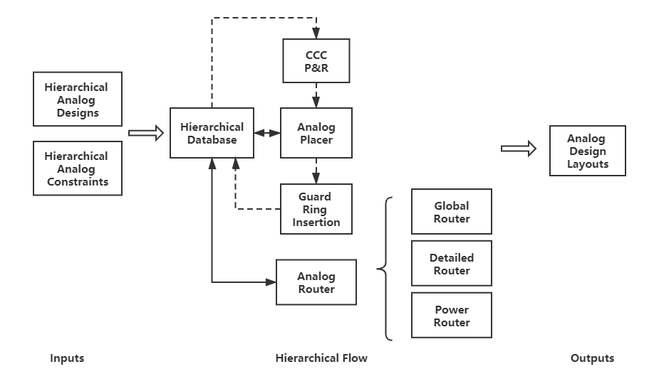

# ALIGN: Hierarchical Analog Placer and Router Flow

## Brief description
The Hierarchical Placer and Router Flow automatically generates layouts for constraints based analog designs. There are four components in the flow, Hierarchical Database (HD), Common Centroid Capacitor (CCC) Placer and Router (P&R), Analog Placer and Analog Router. HD stores the data of hierarchical analog designs and constraints. CCC P&R generates common centroid layout for capacitor array when necessary. Analog Placer handles geometrical constraints, such as symmetry, and alignment constraints. Analog Router handles routing constraints, such as symmetry, shielding and parallel routing constraints. The analog router is composed of global router, detailed router and power router.




## Software description

- Inputs:
	* Analog designs
		* Verilog netlist
		* LEF
		* XX.gds.json for subblock in Verilog netlist
		* GDSII map file
		* PDK file
	* Constraints file
	* Example: [testcase_example](https://github.com/ALIGN-analoglayout/ALIGN-public/tree/master/PlaceRouteHierFlow/testcase_example) 

- Outputs: 
	* Analog design layouts
		* XX.gds.json

## Installation/getting started

### Prerequisite

>-   g++ 5.0 or above
>-   ILP solver: version 5.5.2.5 <http://lpsolve.sourceforge.net/5.5/>
>-   C++ json library: <https://github.com/nlohmann/json.git>
>-   C++ boost libraries: <https://github.com/boostorg/boost>
>-   GTEST: <https://github.com/google/googletest>


### Run in Docker
1.  Build prerequisite image with_protobuf under [build](https://github.com/ALIGN-analoglayout/ALIGN-public/tree/master/build)
``` Shell
docker build -f Dockerfile.build -t with_protobuf .
```
2.  Build the image for the flow
``` Shell
docker build -t placeroute_image .
```
3. Run the test case
``` Shell
(cd testcase_example; tar cvf - .) | docker run --rm -i --mount source=placerInputVol,target=/PlaceRouteHierFlow/INPUT ubuntu /bin/bash -c "cd /PlaceRouteHierFlow/INPUT; tar xvf -"

docker run --rm --mount source=placerInputVol,target=/PlaceRouteHierFlow/INPUT --mount source=placerOutputVol,target=/PlaceRouteHierFlow/OUTPUT placeroute_image /bin/bash -c "cd /PlaceRouteHierFlow; ./pnr_compiler ./testcase_example switched_capacitor_filter.lef switched_capacitor_filter.v switched_capacitor_filter.map layers.json switched_capacitor_filter 2 0"
```

### Run in local
1. Set environment
```Shell
export LP_DIR=<LP_DIR>/lpsolve
export LD_LIBRARY_PATH=<LP_DIR>/lpsolve/lp_solve_5.5.2.5_dev_ux64
export JSON=<JSON_DIR>/json
export BOOST_LP=<BOOST_DIR>/boost
export GTEST_DIR =<GTEST_DIR>/gtest/googletest/googletest
```
2. Compile the flow
```Shell
make
```
3. Run test case
```Shell
./pnr_compiler testcase_DIR testcase.lef testcase.v testcase.map testcase.json testcaseTop numOfLayout optEffort
```

Inputs explaination:
>-   testcase_DIR: string type; the directory of input data
>-   testcase.lef: string type; LEF file
>-   testcase.v: string type; Verilog file
>-   testcase.map: string type; map file for gds.json
>-   testcase.json: string type; PDK file in.json format
>-   testcaseTop: string type; top module name in netlist
>-   numOfLayout: integer type; the max number of generated layouts
>-   optEffort: integer type; optimization effort in range of 0 to 2 (0: low, 1: median, 2: high)

Outputs explaination: (all the results will be saved under 'Results' folder by default)
>-   xx.plt: GNU plot file of placement results
>-   Capxx.gds.json: JSON format of CCC P&R layout
>-   xx_PL.gds.json: JSON format of placement layout
>-   xx_GL.gds.json: JSON format of global routing layout
>-   xx_DR.gds.json: JSON format of detailed routing layout
>-   xx_PR.gds.json: JSON format of power routing layout

## Usage

If the flow is run locally, the operations listed below are necessary:

### Cell Generation
To get the XX_gds.json file, Verlog file, Map file and LEF file, please use the code [Cell Generation](https://github.com/ALIGN-analoglayout/ALIGN-public/tree/master/CellFabric)

### PDK Abstraction
To get the PDK file, please use the code [PDK abstraction](https://github.com/ALIGN-analoglayout/ALIGN-public/tree/master/PDK_Abstraction)

### Conversion from JSON to GDS (from GDS to JSON)
Currently the input/output layout files are in JSON format. To convert the format, please use the codes [GDSConv](https://github.com/ALIGN-analoglayout/ALIGN-public/tree/master/GDSConv).

## Limitations

1) a
2) b

## To-do

1) a
2) b

## LICENSE

The license for the Nangate45nm PDK in this repository can be found in
[platforms](platforms) directory in the [OpenCellLibraryLicenseSi2.txt](platforms/nangate45/OpenCellLibraryLicenseSi2.txt).
The Nangate45nm PDK is downloaded from https://projects.si2.org/openeda.si2.org/project/showfiles.php?group_id=63#503 

The rest of this repository is licensed under BSD 3-Clause License.

>BSD 3-Clause License
>
>Copyright (c) 2019, The Regents of the University of Minnesota
>
>All rights reserved.
>
>Redistribution and use in source and binary forms, with or without
>modification, are permitted provided that the following conditions are met:
>
>* Redistributions of source code must retain the above copyright notice, this
>  list of conditions and the following disclaimer.
>
>* Redistributions in binary form must reproduce the above copyright notice,
>  this list of conditions and the following disclaimer in the documentation
>  and/or other materials provided with the distribution.
>
>* Neither the name of the copyright holder nor the names of its
>  contributors may be used to endorse or promote products derived from
>  this software without specific prior written permission.
>
>THIS SOFTWARE IS PROVIDED BY THE COPYRIGHT HOLDERS AND CONTRIBUTORS "AS IS"
>AND ANY EXPRESS OR IMPLIED WARRANTIES, INCLUDING, BUT NOT LIMITED TO, THE
>IMPLIED WARRANTIES OF MERCHANTABILITY AND FITNESS FOR A PARTICULAR PURPOSE ARE
>DISCLAIMED. IN NO EVENT SHALL THE COPYRIGHT HOLDER OR CONTRIBUTORS BE LIABLE
>FOR ANY DIRECT, INDIRECT, INCIDENTAL, SPECIAL, EXEMPLARY, OR CONSEQUENTIAL
>DAMAGES (INCLUDING, BUT NOT LIMITED TO, PROCUREMENT OF SUBSTITUTE GOODS OR
>SERVICES; LOSS OF USE, DATA, OR PROFITS; OR BUSINESS INTERRUPTION) HOWEVER
>CAUSED AND ON ANY THEORY OF LIABILITY, WHETHER IN CONTRACT, STRICT LIABILITY,
>OR TORT (INCLUDING NEGLIGENCE OR OTHERWISE) ARISING IN ANY WAY OUT OF THE USE
>OF THIS SOFTWARE, EVEN IF ADVISED OF THE POSSIBILITY OF SUCH DAMAGE.
