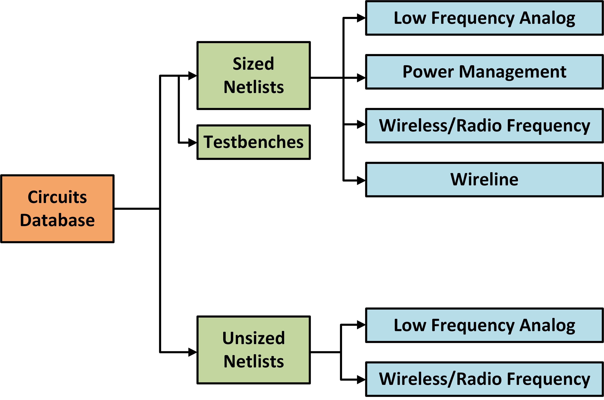

# Circuits Database

* Sized netlists - Contains sized netlists in different technology nodes
* Unsized netlists - Contains unsized netlists generated for training GCN based netlist annotation

## Sized netlists

Designs from four classes of circuits:

* Low frequency analog
* Power Management
* Wireless/Radio frequency
* Wireline

### Testbenches

Generic testbenches enabling plug and play of common modules with different internal topologies

## Unsized netlists

Currently contains designs from two classes of circuits:

* Low frequency analog
* Wireless/Radio frequency
