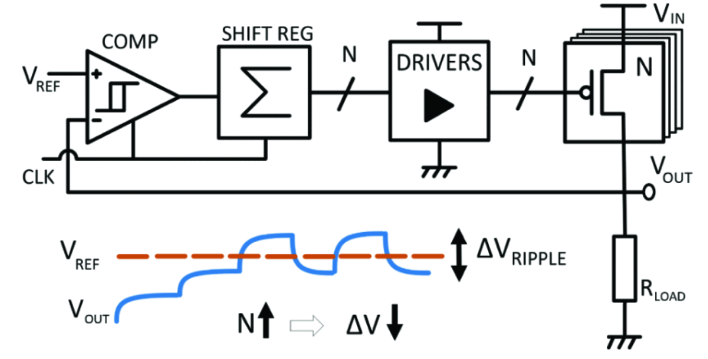
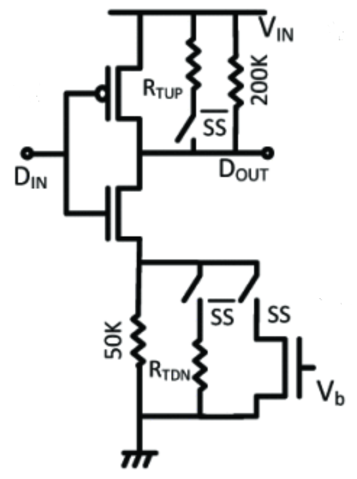
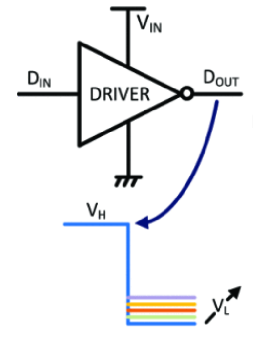

## Gate driver circuit for a DLDO

### Circuit Description

This circuit is a part of the gate driver circuitry in a digital low voltage dropout regulator [1]. This circuit drives PMOS power transistors that supply a load current to the output at a given voltage. 

The block diagram of the system is shown in the figure below.

  

The diagram of the circuit is as follows.

  

### Pin description

* Din - input pulse waveform
* Dout - inverted output pulse waveform
* Vb - gate voltage of transistor in triode that changes the on resistance
* SS - steady state detection signal switch
* SS bar - inverted steady state detection signal switch

The operation of the circuit is highlighted below.

  

When the steady state detection is low, gate driver is a combination of an inverter with a voltage divider. Dout is at a voltage (eg. 250 mV) depending on the ratio of the resistors. When the steady state detection signal is high, the input is maintained constant, the voltage divider also incorporates the resistance contributed by the switch controlled by Vb. As Vb changes, Dout changes.

### Netlist description

* Din - input
* Dout - output
* Vb - control (similar to diagram)
* ss - steady state detection signal 
* ss_bar_nmos - nmos switch controlled by ss_bar
* ss_bar_pmos - pmos switch controlled by ss_bar
* Lres_nmos - on voltage of large nmos resistor
* Lres_pmos - on voltage of large pmos resistor
* Sres_nmos - on voltage of small nmos resistor
* Sres_pmos - on voltage of small pmos resistor

### Initial setup + Testbench

To test this circuit, give a clock waveform at Din and observe Dout in steady state and not in steady state. In steady state, Vb can be changed to observe a change in Dout.

### Constraints

* In steady state there is power dissipation through the voltage divider and any added parasitic routing
* The capacitance at the output will lower the speed of switching when not in steady state
