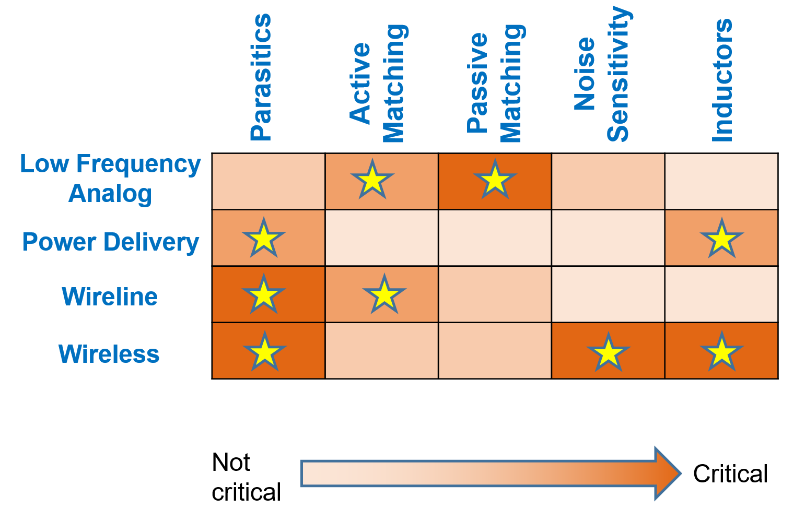

# Sized netlists

Designs from four classes of circuits:

### Low frequency analog

For eg. OTAs, Comparators, ADCs, DAC, Switched capacitor filter

### Power Management

For eg. Switched Capacitor DC-DC converters, Low dropout voltage regulators

### Wireless/Radio frequency

For eg. LNA, Mixer, Bandpass filter, Oscillator

### Wireline

For eg. Variable gain amplifier, linear equalizer

Typical constraints related to these classes of circuits are shown in the figure below.

  

## Testbenches

Generic testbenches enabling plug and play of common modules with different internal topologies

* Low frequency analog

   * Single-ended OTA : Using this testbench, different single-ended OTA topologies (for eg. five transistor OTA, telescopic OTA, current mirror OTA) can be tested.
