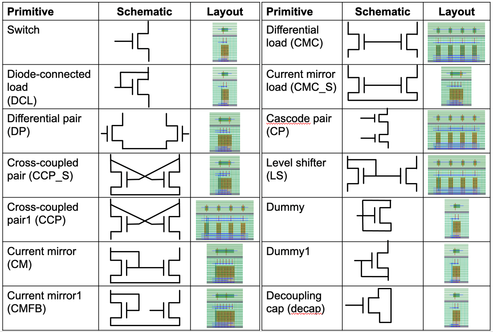

PDK abstraction
===========================================================

ALIGN uses a gridded mock `PDK <https://github.com/ALIGN-analoglayout/ALIGN-public/tree/master/pdks/FinFET14nm_Mock_PDK>`_ which mimics a FinFET PDK to generate layouts.
It follows a similar gridded structure for `bulk echnology nodes <https://github.com/ALIGN-analoglayout/ALIGN-public/tree/master/pdks/Bulk65nm_Mock_PDK>`_ .
A DPK information can be divided into three critical groups: Front End of Line (FEOL), Back End of Line (BEOL), and packaging.
ALIGN uses an abstract representation of FEOL and BEOL information to generate the layouts. These PDK abstarctions are stored in a
`JSON\-format <https://github.com/ALIGN-analoglayout/ALIGN-public/blob/master/pdks/FinFET14nm_Mock_PDK/layers.json>`_ for each PDK.

PDK options
--------------------
List of PDKs options available for users.

* `FinFET14nm_Mock_PDK <https://github.com/ALIGN-analoglayout/ALIGN-public/tree/master/pdks/FinFET14nm_Mock_PDK>`_
* `Bulk65nm_Mock_PDK <https://github.com/ALIGN-analoglayout/ALIGN-public/tree/master/pdks/Bulk65nm_Mock_PDK>`_

Defintion of BEOL Design rules
-------------------------------

* **Layer**: Defines name of a layer e.g. Poly, M1 etc.
* **GdsLayerNo**: This number is used for layer mapping in GDSII generation
* **Direction**: Defines the allowed direction for a layer e.g. V (Vertical) or H (Horizontal); for ‘Via’ layer direction is not applicable
* **Width**:  Defines valid widths for a layer
* **Pitch**: Center-to-Center distance for a same layer (Fig. 1); for ‘Via’ pitch is not applicable
* **EndToEnd**: Minimum end-to-end spacing for a same layer (Fig. 2); NA for ‘Via’ layer
* **Offset**: Defines a layer offset from X or Y- axis; It is shown in Fig. 3 for a layer in V direction
* **MinL**: Minimum required metal length for a metal layer in a defined direction (nm)
* **MaxL**: Maximum allowed metal length for a metal layer in a defined direction (nm)
* **UnitC**: Unit capacitance for a metal layer (pF/nm)
* **UnitCC**: Unit coupling capacitance for a metal layer (pF/nm)
* **UnitR**: Unit resistance for a metal layer (ohm/nm)
* **Color**: List of masks for Double Patterning Technology, DPT
* **SpaceX/SpaceY**: Minimum spacing between Vias along X/Y direction
* **Stack**: Metal layers which are connected using the Via
* **VencA_L/VencA_H** Minimum enclosure of a Via by a lower/higher metal layer along its ‘Direction’
* **VencP_L/VencP_H**:  Minimum enclosure of a Via by a lower/higher metal layer along perpendicular to its ‘Direction’

.. image:: ../images/design_rules.PNG

.. image:: ../images/via_rules.PNG

.. code-block:: python3

   #Example technology abstarction for a metal layer from layers.json
   {
   "Layer": "M2",
   "GdsLayerNo": 15,
   "GdsDatatype": {"Draw":0, "c1":1, "c2":2, "Pin":3, "Label":4, "Blockage":5},
   "Direction": "H",
   "Color": ["c2", "c1"],
   "Pitch": 84,
   "Width": 32,
   "MinL": 200,
   "MaxL": null,
   "EndToEnd": 48,
   "Offset": 0,
   "UnitC": {"L_3Sigma":0.16, "Mean":0.2, "U_3Sigma":0.24},
   "UnitCC": {"L_3Sigma":0.08, "Mean":0.1, "U_3Sigma":0.12},
   "UnitR": {"L_3Sigma":40, "Mean":50, "U_3Sigma":60}
   },
   {
   "Layer": "V2",
   "GdsLayerNo": 16,
   "GdsDatatype": {"Draw":0},
   "Stack": ["M2", "M3"],
   "SpaceX": 48,
   "SpaceY": 40,
   "WidthX": 32,
   "WidthY": 32,
   "VencA_L": 20,
   "VencA_H": 20,
   "VencP_L": 0,
   "VencP_H": 4,
   "R": {"L_3Sigma":15, "Mean":25, "U_3Sigma":35}
   }

Defintion of FEOL Design rules
-------------------------------

These layers are used by the cell generator and may vary based on the PDK. Our placer and router does not use these layers.
We are defining here a list of common FEOL layer rules and it is not an exhaustive set. Some technology nodes may have different FEOL layers.

* **Layer**: Defines name of a layer e.g. Nwell, Active, Nselect, Pselect, Gcut, Lisd, Rvt, Lvt, Hvt, Boundary etc.
* **PcWidth**: Poly-contact width
* **PcExt**: Poly-contact extension

.. code-block:: python3

   #Example technology abstarction for a FEOL layer from layers.json
   {
   "Layer": "Pc",
   "GdsLayerNo": 99,
   "GdsDatatype": {"Draw":0},
   "PcWidth": 32,
   "PcExt": 2
   }

Cell generator
================

Cell generator creates layout of primitive cells which are common across analog designs such as transistors, differential pairs, current mirrors.
A list of `cell generators <https://github.com/ALIGN-analoglayout/ALIGN-public/blob/master/pdks/FinFET14nm_Mock_PDK/generators.json>`_ is available for each PDK.
ALIGN cell generator can also be used as a standalone tool. The image shows some of the align generated primitives.

Standalone usage
-----------------

Individual cells can be generated in ALIGN using primitive generator. During full flow compiler identifies these primitives and
call primitive generator to create the layout of these primitives.

ALIGN generated primitives as an array of individual transistors/resistors. The aspect ratio of generated cells can be controlled using Xcells and Ycells parameters.
There are four basic cell types which are handled using align cell generrator.
* `Transistor <https://github.com/ALIGN-analoglayout/ALIGN-public/blob/master/pdks/FinFET14nm_Mock_PDK/Align_primitives.py>`_
* `Capacitor <https://github.com/ALIGN-analoglayout/ALIGN-public/blob/master/pdks/FinFET14nm_Mock_PDK/fabric_Cap.py>`_
* `Resistor <https://github.com/ALIGN-analoglayout/ALIGN-public/blob/master/pdks/FinFET14nm_Mock_PDK/fabric_Res.py>`_.
* `Guard ring <https://github.com/ALIGN-analoglayout/ALIGN-public/blob/master/pdks/FinFET14nm_Mock_PDK/fabric_ring.py>`_.

Cell fabric
------------
Cell fabric module defines the common structure for cell generation utilities which are used in the primitive generator. This remains common across PDKs.

Primitive
-----------

This module is used to generate the actual primitives (Resistor/Capacitor/Transistor/Via-array/GuardRing) for a PDK.
These may need to be modified for each PDK based on the available layers. It uses the functions defined in the Cell fabric module to create cell layers.

Here is an example on how to add a layer for a `mos generator <https://github.com/ALIGN-analoglayout/ALIGN-public/blob/master/align/primitive/default/mos.py>`_.

.. code-block:: python3

   # Example: adding a Poly metal layer

   self.pl = self.addGen( Wire( 'pl', 'Poly', 'v',
                              clg=UncoloredCenterLineGrid( pitch= self.pdk['Poly']['Pitch'], width= self.pdk['Poly']['Width'], offset= self.pdk['Poly']['Offset']),
                              spg=SingleGrid( offset= self.pdk['M2']['Offset'], pitch=self.unitCellHeight)
                              )
                        )

   # Example: adding a Via
   self.va = self.addGen( Via( 'va', 'V0',
                           h_clg=self.m2.clg,
                           v_clg=self.m1.clg,
                           WidthX=self.pdk['V0']['WidthX'],
                           WidthY=self.pdk['V0']['WidthY']))