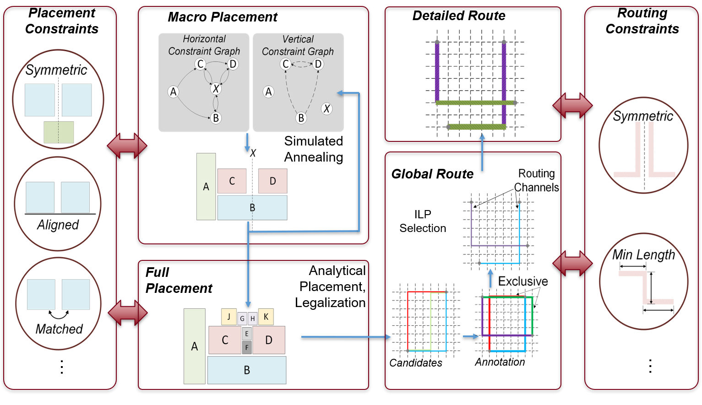

Constraints
===========================================================
Analog designers uses constraints to achieve best performance from a layout.

The ALIGN flow identifies symmetries and array structures in the design and generate layout constraints automatically but designers can add their own constraint for better control.
Here, are the list of constraints used in align. These constraints are applied on the instances (instances of NMOS/PMOS/Resistor/Capacitor/Subcircuit) or on nets.
These constraints need to be defined seperately for each of the hierachies with name ``<hier name>.const.json``, defined in the schematic.

Constraint options
--------------------
List of options available for users.

SymmetricBlocks
################
.. autoclass:: align.schema.constraint.SymmetricBlocks
   :noindex:

Order
######
.. autoclass:: align.schema.constraint.Order
   :noindex:

Align
######
.. autoclass:: align.schema.constraint.Align
   :noindex:

Enclose
#########
.. autoclass:: align.schema.constraint.Enclose
   :noindex:

Spread
#######
.. autoclass:: align.schema.constraint.Spread
   :noindex:

AspectRatio
############
.. autoclass:: align.schema.constraint.AspectRatio
   :noindex:

Boundary
#########
.. autoclass:: align.schema.constraint.Boundary
   :noindex:

AlignInOrder
#############
.. autoclass:: align.schema.constraint.AlignInOrder
   :noindex:

CompactPlacement
#################
.. autoclass:: align.schema.constraint.CompactPlacement
   :noindex:

SameTemplate
#############
.. autoclass:: align.schema.constraint.SameTemplate
   :noindex:

CreateAlias
############
.. autoclass:: align.schema.constraint.CreateAlias
   :noindex:

GroupBlocks
###########
.. autoclass:: align.schema.constraint.GroupBlocks
   :noindex:

DoNotIdentify
##############
.. autoclass:: align.schema.constraint.DoNotIdentify
   :noindex:

BlockDistance
#############
.. autoclass:: align.schema.constraint.BlockDistance
   :noindex:

HorizontalDistance
##################
.. autoclass:: align.schema.constraint.HorizontalDistance
   :noindex:

VerticalDistance
#################
.. autoclass:: align.schema.constraint.VerticalDistance
   :noindex:

GuardRing
#############
.. autoclass:: align.schema.constraint.GuardRing
   :noindex:

GroupCaps
#############
.. autoclass:: align.schema.constraint.GroupCaps
   :noindex:

NetConst
#############
.. autoclass:: align.schema.constraint.NetConst
   :noindex:

PortLocation
#############
.. autoclass:: align.schema.constraint.PortLocation
   :noindex:

SymmetricNets
#############
.. autoclass:: align.schema.constraint.SymmetricNets
   :noindex:

MultiConnection
################
.. autoclass:: align.schema.constraint.MultiConnection
   :noindex:

PowerPorts
#############
.. autoclass:: align.schema.constraint.PowerPorts
   :noindex:

GroundPorts
#############
.. autoclass:: align.schema.constraint.GroundPorts
   :noindex:

ClockPorts
#############
.. autoclass:: align.schema.constraint.ClockPorts
   :noindex:

DoNotUseLib
#############
.. autoclass:: align.schema.constraint.DoNotUseLib
   :noindex:

IdentifyArray
###################
.. autoclass:: align.schema.constraint.ConfigureCompiler
   :noindex:

Example constraints
---------------------

Users can add constraints for each hierarchy levele with a file name ``Subcircuit_name.const.json``. An example file for high_speed_comparator design is shown here.

.. code-block:: python3

	#filename: high_speed_comparator.const.json
	[
		{   "constraint":"HorizontalDistance",
			"abs_distance":0
		},
		{   "constraint":"VerticalDistance",
			"abs_distance":0
		},
		{   "constraint": "GroupBlocks",
			"instances": ["mmn0", "mmn1"],
			"name": "diffpair"
		},
		{   "constraint":"GroupBlocks",
			"instances": ["mmn4", "mmn3"],
			"name": "ccn"
		},
		{   "constraint": "GroupBlocks",
			"instances": ["mmp1", "mmp0"],
			"name": "ccp"
		},
		{   "constraint": "SymmetricBlocks",
			"direction" : "V",
			"pairs": [["mmn2"], ["diffpair"], ["ccn"], ["ccp"]]
		},
		{   "constraint": "order",
			"instances": ["mmn2", "diffpair", "ccn", "ccp"],
			"direction": "top_to_bottom"
		}
	]
