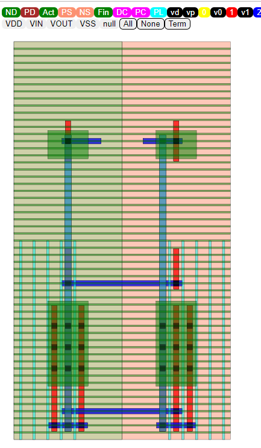

Layout viewer
==============

The final output GDS can be viewed using by importing in virtuoso or any GDS viewer

KLayout viewer
---------------

`KLayout <https://github.com/KLayout/klayout>`_ viewer is an open source GDS viewer which you can use to see the align generated layouts.

.. note:: WSL users would need to install xming for display to work

ALIGN viewer
-------------
ALIGN `Viewer <https://github.com/ALIGN-analoglayout/ALIGN-public/tree/master/Viewer>`_ is javascript based viewer which can be used to view the ALIGN genreated JSON file results.

* Start a python server from the Viewer directory

.. code-block:: bash

    python3 -m http.server 8085

* Copy the <DESIGN_name_0>.JSON from work/3_pnr/ directory to Viewer/INPUT

* From your browser go to:  localhost:8085/?design=DESIGN_name_0

