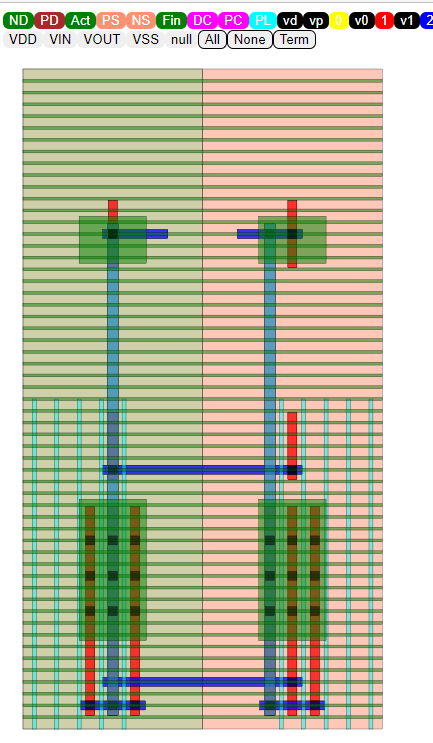

Viewer
==========

The final output GDS can be viewed using by importing in virtuoso or any GDS viewer

* `KLayout <https://github.com/KLayout/klayout>`_: GDS viewer (WSL users would need to install xming for display to work)

* `Viewer <https://github.com/ALIGN-analoglayout/ALIGN-public/tree/master/Viewer>`_: ALIGN Layout viewer to view output JSON file

ALIGN viewer
-------------
* Start a python server from the Viewer directory

.. code-block:: bash

    python3 -m http.server 8085

* Copy the <DESIGN_name_0>.JSON from work/3_pnr/ directory to Viewer/INPUT

* From your browser go to:  localhost:8085/?design=DESIGN_name_0

