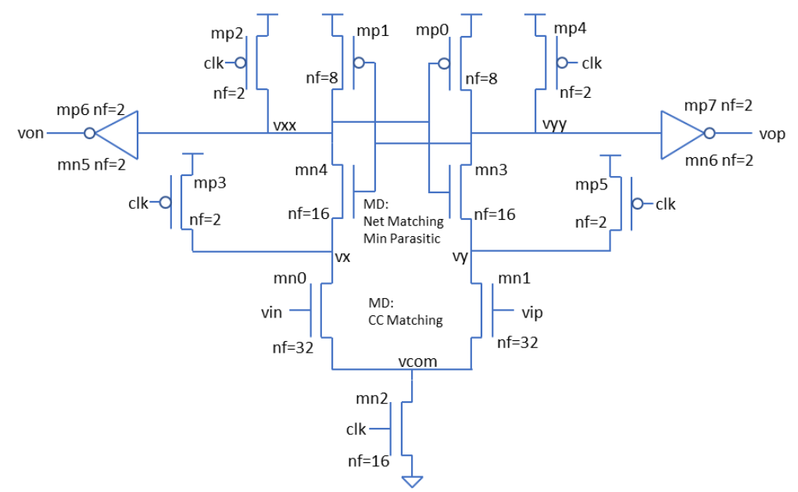

This is a high speed comparator circuit based on modified StrongARM latch:



The circuit goes thru the flow w/o errors. However, subcircuits have not been identified as expected except the input differential pair.  

Generated Verilog view:
```v
//Verilog block level netlist file for high_speed_comparator
//Generated by UMN for ALIGN project


module high_speed_comparator ( vip, von, vss, vdd, clk, vop, vin );
input vip, von, vss, vdd, clk, vop, vin;

Switch_NMOS_n12_X4_Y2 mmn3 ( .D(vyy), .G(vxx), .S(vy) );
CMC_PMOS_S_n12_X2_Y2 mmp6_mmp0 ( .DA(von), .G(vxx), .DB(vyy), .S(vdd) );
CMC_PMOS_S_n12_X2_Y2 mmp7_mmp1 ( .DA(vop), .G(vyy), .DB(vxx), .S(vdd) );
CMC_PMOS_S_n12_X1_Y1 mmp3_mmp4 ( .DA(vx), .G(clk), .DB(vyy), .S(vdd) );
CMC_PMOS_S_n12_X1_Y1 mmp2_mmp5 ( .DA(vxx), .G(clk), .DB(vy), .S(vdd) );
DP_NMOS_n12_X4_Y2 mmn2_mmn5 ( .DA(vcom), .GA(clk), .S(vss), .DB(von), .GB(vxx) );
DP_NMOS_n12_X4_Y4 mmn0_mmn1 ( .DA(vx), .GA(vin), .S(vcom), .DB(vy), .GB(vip) );
CMC_NMOS_n12_X4_Y2 mmn6_mmn4 ( .DA(vop), .G(vyy), .DB(vxx), .SA(vss), .SB(vx) );

endmodule

```

__Generated layout needs to be verified.__
