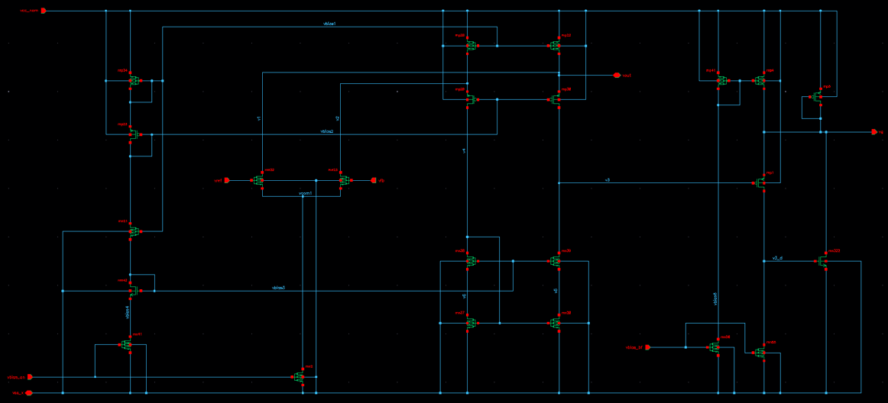

This is an error amplifier used in a low drop out (LDO) voltage regulator circuit based on folded cascode amplifier followed by super source follower. The compensation capacitor is not part of the netlist.

The circuit goes thru the flow w/o errors. Subcircuit identification needs improvement (e.g., false positives: pseudo-dp, cmfb, ..).

